# RunneriOSFrontend
iOS Application build using Swift. 
Networking from Alamofire.
Dependency Manager from CocoaPods.

| Launch | Login | Sign Up|
| --- | --- | --- |
| 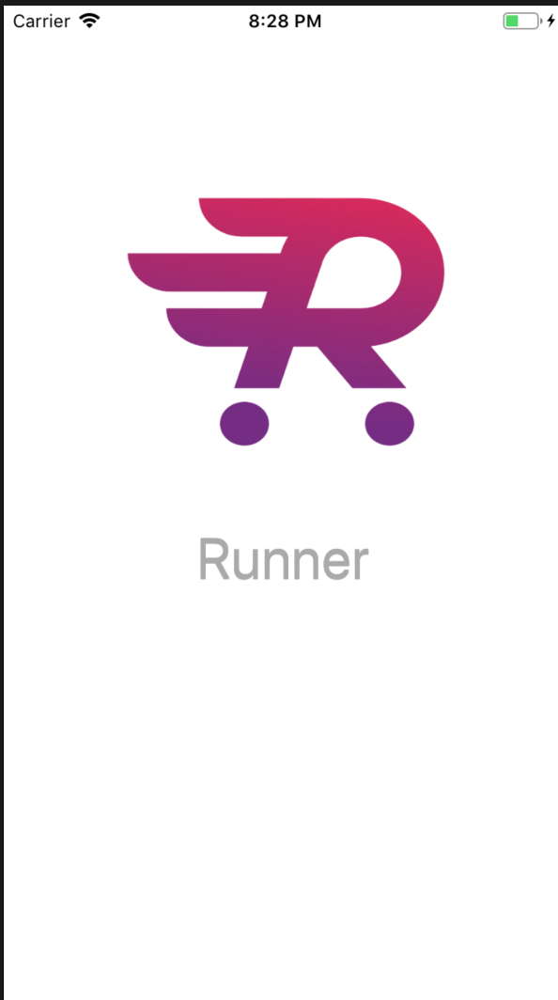 | 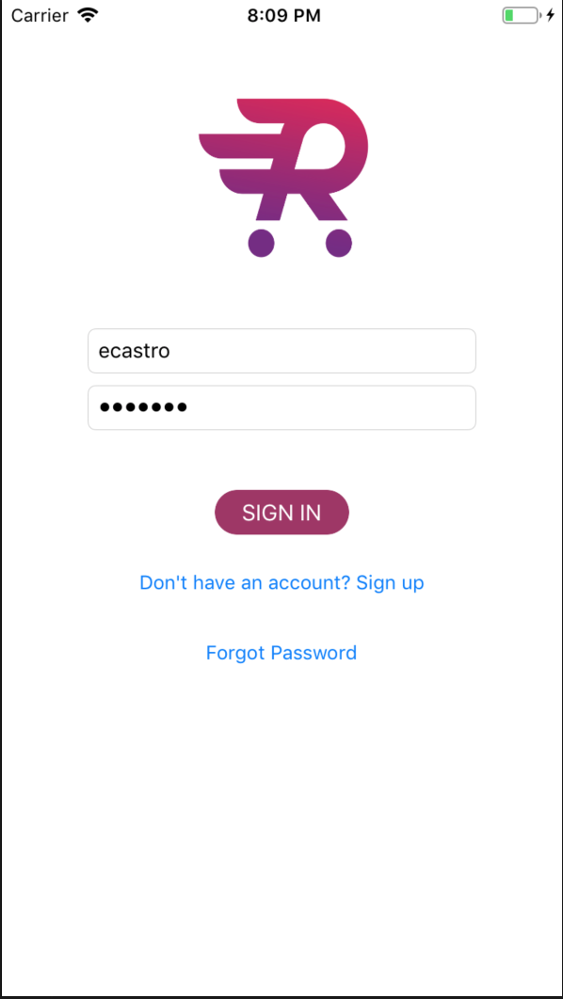 | 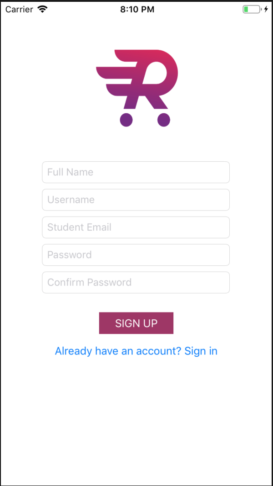 |

| Main Feed | My Posted Tasks | Profile|
| --- | --- | --- |
| 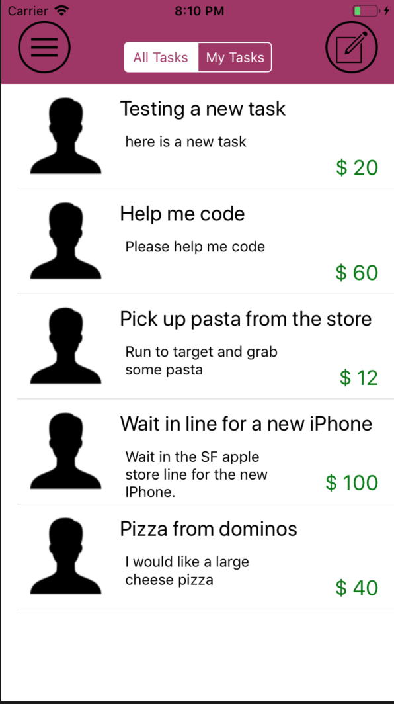 | 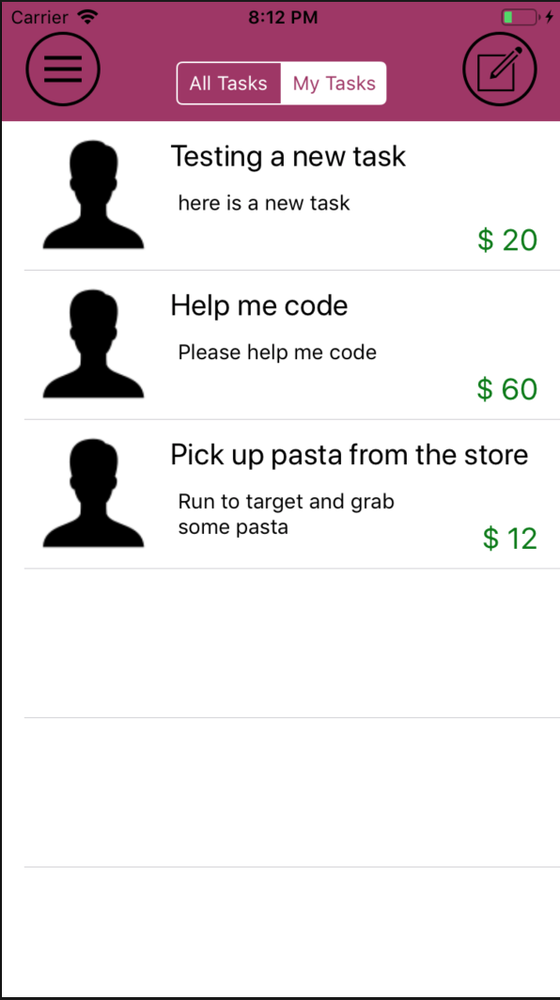 | 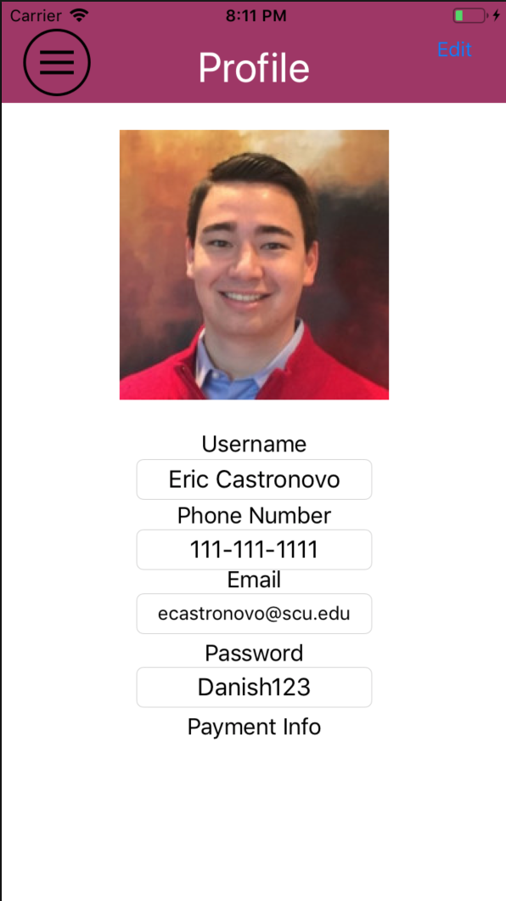 |

| Menu | Create Task | Task Details|
| --- | --- | --- |
| 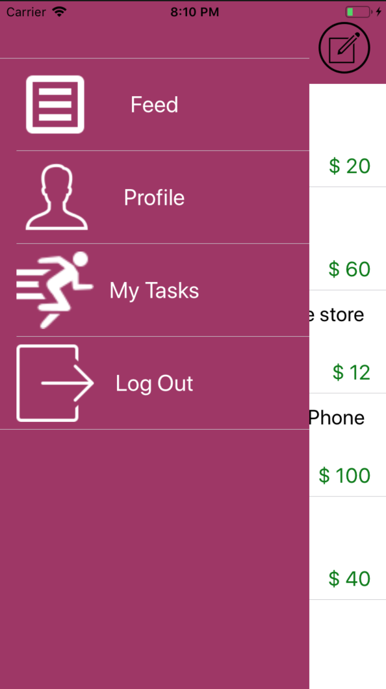 | 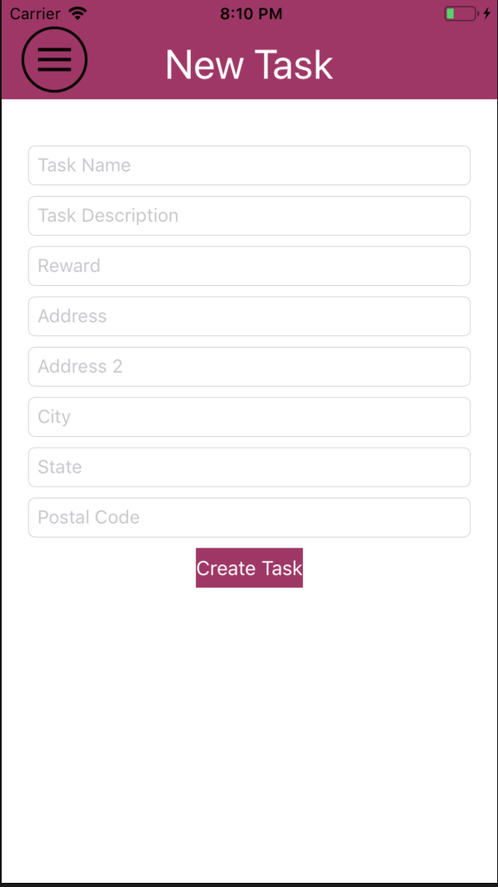 | 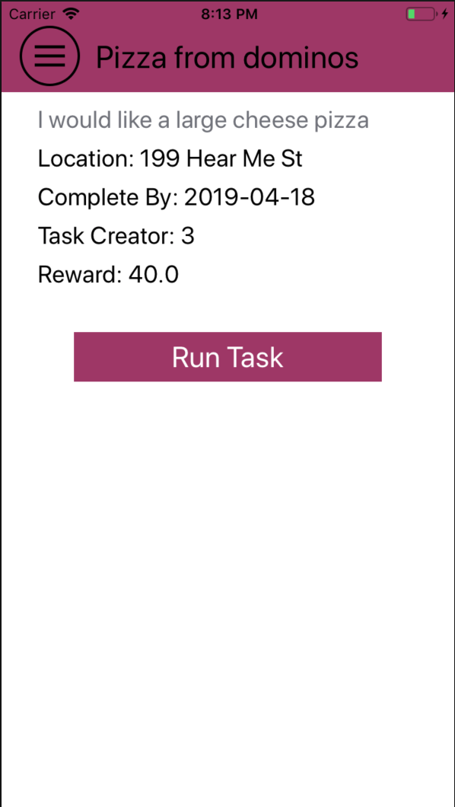 |

| View Completed Tasks | View Tasks In Progress | Backend |
| --- | --- | --- |
| 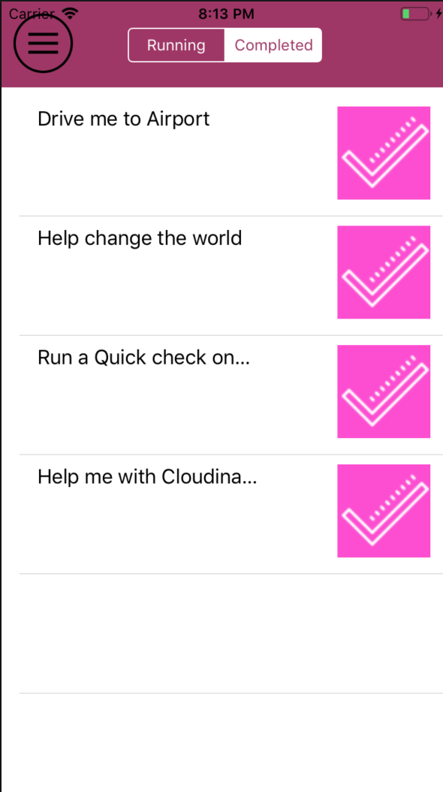 | 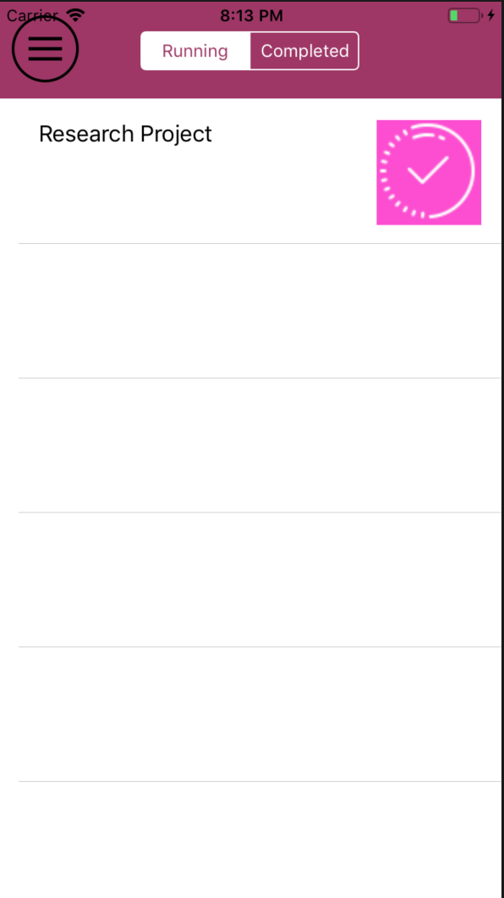 |   Backend exists within another GitHub Repo.  Backend is needed to operate database functionality.  Backend build with Django Rest Framework using Postgres.|

## Note 
Backend is located in another repo built on the Django Rest Framework. 
Backend development was created by Dimple Maniar.
